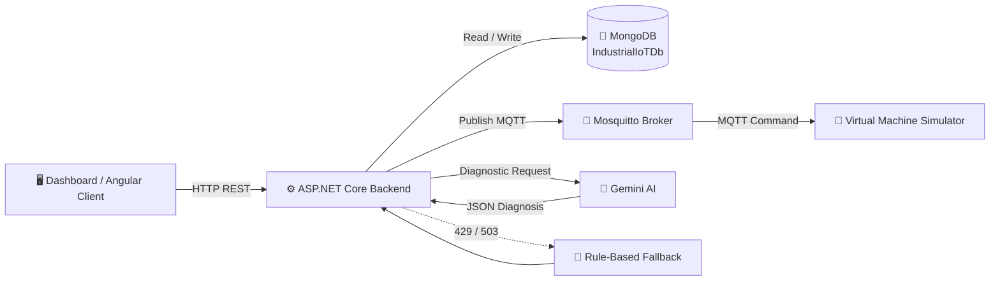

<div align="center">

# 🤖 Industrial IoT Dashboard

### Smart Machine Monitoring • Predictive Maintenance • AI Diagnostics • MQTT Control

<p>
  
  
  
  
  
  
</p>

<p>
  <strong>Industrial machine monitoring and control platform built around ASP.NET Core, MongoDB and MQTT.</strong>
</p>

</div>

---

## 📌 Overview

**Industrial IoT Dashboard** is a backend-oriented Industrial IoT platform for monitoring machine health, storing telemetry, managing maintenance records, sending machine commands through MQTT, and generating AI-assisted diagnostic results.

The project is designed around a simple architecture:

> **Dashboard / Client → ASP.NET Core API → MongoDB + MQTT → Virtual Machine Simulator**

The backend also provides **Stitch AI**, which analyzes machine information and operator commands to return a structured diagnostic response. If the external AI service is unavailable because of high demand or rate limiting, the system can switch to a built-in **rule-based fallback**.

---

## ✨ Key Features

| Feature | Description |
|---|---|
| 🏭 **Machine Management** | Register, list and delete industrial machines |
| 📡 **Telemetry** | Store and retrieve machine health data |
| 📊 **Condition Monitoring** | Track temperature, vibration, current, yield and error codes |
| 🔧 **Maintenance History** | Store maintenance records and retrieve history per machine |
| 📅 **Preventive Maintenance** | Machine model contains last/next maintenance information |
| 📡 **MQTT Communication** | Send commands between the backend and virtual machines |
| 🖥️ **Virtual Machine Simulator** | Simulates MQTT-connected machines and displays incoming commands |
| 🧠 **Stitch AI Diagnostics** | Analyze machine status and operational data |
| 🛟 **AI Fallback System** | Rule-based diagnostics when AI API returns `429` or `503` |
| 📚 **Swagger / OpenAPI** | API documentation during development |
| 🌐 **CORS** | Configured to accept requests from an Angular client on `localhost:4200` |

---

# 🏗️ System Architecture



### 🔄 Main Data Flow

```text
Machine / Simulator
       │
       ▼
   MQTT Broker
       │
       ▼
ASP.NET Core API
   ┌───┼───────────────┐
   ▼   ▼               ▼
MongoDB  MQTT       Stitch AI
   │     │               │
   │     ▼               ▼
   │  Commands      Diagnosis JSON
   │
   └──────────► Dashboard
```

---

# 📁 Project Structure

```text
IOT_Dashboard_Project-main/
│
├── 📂 VirtualMachineSimulator/
│   ├── Program.cs
│   └── VirtualMachineSimulator.csproj
│
├── 📂 iot-dashboard-backend/
│   ├── 📂 Controllers/
│   │   ├── MachineController.cs
│   │   ├── MaintenanceController.cs
│   │   ├── StitchAiController.cs
│   │   └── TelemetryController.cs
│   │
│   ├── 📂 Models/
│   │   ├── Machine.cs
│   │   ├── MaintenanceRecord.cs
│   │   ├── StitchAiModels.cs
│   │   └── Telemetry.cs
│   │
│   ├── 📂 Services/
│   │   └── MqttPublishService.cs
│   │
│   ├── Program.cs
│   ├── appsettings.json
│   └── iot-dashboard-backend.csproj
│
├── 📂 mqtt-broker/
│   ├── 📂 config/
│   │   └── mosquitto.conf
│   └── docker-compose.yml
│
└── .gitignore
```

> ℹ️ **Updated:** The latest project archive now includes the Angular frontend under `iot-dashboard-frontend/`. The frontend is an Angular 21 standalone SPA with four main pages: Overview Dashboard, Stitch AI Center, Machine Fleet, and Work Orders.

---

# 🧩 Technology Stack

### Backend

- **ASP.NET Core 8**
- **C#**
- **MongoDB.Driver 3.11.1**
- **MQTTnet 4.3.3.952**
- **Swashbuckle.AspNetCore 10.2.3**

### Frontend

- **Angular 21.2**
- **TypeScript 5.9**
- **Angular Standalone Components**
- **Angular Router**
- **RxJS 7.8**
- **Tailwind CSS 4.3**
- **Chart.js 4.5 + ng2-charts 10**
- **Nginx** for production/static hosting


### IoT / Messaging

- **MQTT**
- **Eclipse Mosquitto**
- **Docker Compose**
- MQTT Port: `1883`
- WebSocket Port: `9001` *(configured for future use)*

### AI

- **Google Gemini API**
- Model configured in `appsettings.json`
- Structured JSON diagnostic response
- Rule-based fallback for `429` / `503`

### Virtual Device

- **.NET 9**
- **MQTTnet**
- Virtual machine command listener

---

---

# 🖥️ Frontend — Angular Dashboard

The updated project includes a complete Angular frontend at:

```text
iot-dashboard-frontend/
```

The frontend is a **standalone Angular 21 Single Page Application (SPA)**. It provides the operator-facing dashboard and communicates with the ASP.NET Core backend through REST APIs.

## 🎯 Frontend Responsibilities

| Area | Responsibility |
|---|---|
| 🧭 Navigation | SPA routing between dashboard pages without full page refresh |
| 📊 Overview | Display machine counts, operational rate, runtime/cycle metrics and temperature charts |
| 🏭 Machine Fleet | List machines, add machines and view maintenance history |
| 🤖 Stitch AI Center | Select a machine, send diagnostic prompts, display AI results and issue machine commands |
| 🛠️ Work Orders | Generate UI work-order entries from current machine status/runtime and complete maintenance sign-off |
| 📡 Simulation | Generate dummy machine status/runtime/cycle updates from the browser |
| 🔌 API Integration | Use `HttpClient` services to communicate with the .NET backend |

## 📁 Frontend Structure

```text
iot-dashboard-frontend/
│
├── src/
│   ├── app/
│   │   ├── layouts/
│   │   │   ├── main-layout/
│   │   │   │   ├── main-layout.component.ts
│   │   │   │   └── main-layout.component.html
│   │   │   └── templates/
│   │   │       └── modal/
│   │   │           └── modal.component.ts
│   │   │
│   │   ├── pages/
│   │   │   ├── overview-dashboard/
│   │   │   ├── stitch-ai-center/
│   │   │   ├── machine-fleet/
│   │   │   └── work-orders/
│   │   │
│   │   ├── services/
│   │   │   ├── machine.service.ts
│   │   │   ├── telemetry.service.ts
│   │   │   ├── stitch-ai.service.ts
│   │   │   └── machine-simulation.service.ts
│   │   │
│   │   ├── app.ts
│   │   ├── app.html
│   │   ├── app.routes.ts
│   │   ├── app.config.ts
│   │   └── app.scss
│   │
│   ├── main.ts
│   └── styles.scss
│
├── angular.json
├── package.json
├── Dockerfile
└── nginx.conf
```

## 🧭 Routing

`app.routes.ts` defines a shared `MainLayoutComponent` and places the four application pages inside its child routes:

```text
/overview
/stitch-ai-center
/machine-fleet
/work-orders
```

The empty route redirects to:

```text
/stitch-ai-center
```

Unknown routes also redirect to the Stitch AI Center.

### Why this design?

The layout is separated from page content so the sidebar/navigation remains consistent while Angular swaps only the page inside `<router-outlet>`.

```text
App
 └── RouterOutlet
      └── MainLayout
           ├── Sidebar / Navigation
           └── RouterOutlet
                ├── Overview Dashboard
                ├── Stitch AI Center
                ├── Machine Fleet
                └── Work Orders
```

---

# 🔌 Frontend Services & API Communication

The frontend keeps HTTP communication in dedicated services instead of placing all API calls directly inside page components.

## 1. `MachineService`

```text
src/app/services/machine.service.ts
```

Responsibilities:

- `GET /api/Machine` → load all machines
- `POST /api/Machine` → create a machine
- `DELETE /api/Machine/{id}` → delete a machine

The `Machine` TypeScript interface mirrors the important backend machine fields:

```text
id / _id
machineName
machineType
status
runTimeHours
cycleCount
lastMaintenanceDate
nextMaintenanceDate
calibrationDriftOffset
```

The frontend also accepts either `id` or `_id` when selecting a machine. This makes the UI tolerant of the MongoDB identifier shape returned by different serialization configurations.

## 2. `TelemetryService`

```text
src/app/services/telemetry.service.ts
```

Calls:

```http
GET /api/Telemetry/{machineId}
```

The service expects telemetry objects containing:

```text
machineId
temperature
vibrationLevel
currentDraw
yieldRate
errorCode
timestamp
```

The backend currently returns up to the latest 100 telemetry records for a machine.

## 3. `StitchAiService`

```text
src/app/services/stitch-ai.service.ts
```

Calls:

```http
POST /api/StitchAi/diagnose
```

Request:

```json
{
  "machineId": "YOUR_MACHINE_ID",
  "manualCommand": "Analyze current machine condition"
}
```

Response expected by Angular:

```json
{
  "rootCause": "...",
  "impactPrediction": "...",
  "recommendation": "...",
  "confidenceScore": 82.5
}
```

The service also stores the latest diagnostic result in Angular signals:

```text
savedDiagnostic
savedMachineId
```

This allows the Stitch AI page to retain the latest result while navigating between frontend pages during the same SPA session.

## 4. `MachineSimulationService`

```text
src/app/services/machine-simulation.service.ts
```

This is a **frontend-side dummy telemetry simulator**.

When started, it:

1. Receives one machine ID or an array of machine IDs.
2. Creates an RxJS `interval(60000)`.
3. Every 60 seconds, increases runtime and cycle count with randomized values.
4. Generates a randomized status.
5. Sends the values to:

```http
PUT /api/Machine/{id}/telemetry
```

The service stores each RxJS subscription in a `Map`, preventing the same machine from being simulated multiple times.

When simulation is stopped, all subscriptions are unsubscribed.

### Important distinction

This is not the same as the `.NET VirtualMachineSimulator`.

There are currently **two simulation concepts**:

```text
Angular MachineSimulationService
        │
        └── updates machine telemetry through REST

.NET VirtualMachineSimulator
        │
        └── listens for MQTT machine commands
```

The Angular simulation updates machine state through the backend API, while the .NET simulator is focused on receiving MQTT commands.

---

# 📊 Frontend Page Behavior

## 1. Overview Dashboard

The Overview page loads machine information using `MachineService`.

It calculates/display metrics such as:

- Total machines
- Running/online machines
- Operational rate
- Total cycle count
- Total runtime
- Estimated average throughput
- System anomalies
- Critical alerts

It also uses `TelemetryService` and `ng2-charts` / Chart.js for the temperature-trend visualization.

### Important implementation detail

Some Overview values are **calculated in the frontend from the machine data** rather than being returned as dedicated backend metrics.

Therefore, labels such as:

```text
Avg Throughput (Est.)
```

should be understood as a frontend-derived estimate, not a production-grade OEE/throughput calculation.

---

## 2. Machine Fleet

The Machine Fleet page provides:

- Machine list
- Machine status badges
- Runtime and cycle information
- Add Machine modal
- Delete-machine interaction
- Maintenance history modal

The Add Machine form uses Angular Reactive Forms and validates the fields before sending:

```http
POST /api/Machine
```

The page also retrieves maintenance history from:

```http
GET /api/Maintenance/machine/{machineId}
```

### Data flow

```text
User fills Add Machine form
        │
        ▼
Reactive Form validation
        │
        ▼
MachineService.addMachine()
        │
        ▼
POST /api/Machine
        │
        ▼
ASP.NET Core
        │
        ▼
MongoDB → Machines
        │
        ▼
Angular refreshes machine list
```

---

## 3. Stitch AI Center

The Stitch AI Center is the main diagnostic and control interface.

The page:

1. Loads available machines.
2. Lets the operator choose a target machine.
3. Provides predefined quick diagnostic actions.
4. Allows a manual diagnostic prompt.
5. Sends the prompt to the backend.
6. Displays root cause, impact prediction, recommendation and confidence.
7. Stores the latest result in `StitchAiService`.
8. Provides machine-control actions.

### Diagnostic flow

```text
Operator
   │
   ▼
Select Machine + Diagnostic Query
   │
   ▼
StitchAiService
   │
   ▼
POST /api/StitchAi/diagnose
   │
   ▼
ASP.NET Core StitchAiController
   │
   ├── MongoDB → Read machine state
   │
   └── Gemini API
          │
          ├── Success → JSON diagnosis
          │
          └── 429 / 503 → Rule-based fallback
   │
   ▼
Angular Diagnostic Card
```

### Machine command flow

The frontend sends:

```http
POST /api/Machine/{id}/command
```

with:

```json
{
  "action": "APPROVE"
}
```

Supported actions in the current code are:

```text
APPROVE
OVERRIDE
EMERGENCY_STOP
```

The backend changes the stored machine status and then publishes an MQTT command.

```text
Angular
   │
   ▼
POST /api/Machine/{id}/command
   │
   ▼
MachineController
   │
   ├── Update MongoDB status
   │
   └── MqttPublishService
          │
          ▼
      Mosquitto
          │
          ▼
VirtualMachineSimulator
```

---

## 4. Work Orders

The current Work Orders page does **not** use a dedicated Work Order collection/API.

Instead, it builds work-order entries dynamically from the current machine list.

The frontend evaluates:

```text
Machine Status
Run Time Hours
```

and maps them to:

```text
Priority
Status
Description
Origin
```

Examples of current rules:

| Machine condition | Generated UI behavior |
|---|---|
| `Offline` / `Error` | Critical + Queued |
| `Maintenance` / `Warning` | Medium + In Progress |
| Runtime > 1000 hours | Medium + Queued |
| Otherwise | Normal + Completed |

This is a **frontend-derived work-order view**, not yet a persistent Work Order management module.

### Maintenance Sign-Off

The UI provides a sign-off modal containing:

- Technician name
- Resolution notes
- Signature interaction
- Completion action

The backend already exposes:

```http
POST /api/Maintenance
```

for saving maintenance records.

**Implementation note:** the current `WorkOrdersComponent` contains the sign-off UI and state logic, but the current code should be verified before claiming that every sign-off interaction is persisted to `POST /api/Maintenance`. The visible Work Order generation itself is definitely derived from `MachineService`, not from a Work Order API.

---

# 🎨 Frontend UI / Design System

The frontend follows the "Stitch AI Command Center / Flip7 Dark Edition" visual direction.

Main design tokens include:

```text
Background:       #0B1514
Panel:             #162B29
Interactive:       #1E3835
Primary Text:      #E8F6F5
Neon Teal:         #4ED9D3
Teal:              #2BA8A2
Gold:              #FFD23F
Coral:             #EF6C4A
Sky Blue:          #5DADE2
```

The UI uses:

- Tailwind CSS utility classes
- Responsive CSS Grid/Flexbox
- Standalone Angular components
- Reusable modal component
- Angular signals for local/reactive UI state
- Chart.js through `ng2-charts`

---

# 🐳 Frontend Docker Deployment

The frontend includes:

```text
iot-dashboard-frontend/Dockerfile
iot-dashboard-frontend/nginx.conf
```

The Dockerfile uses a two-stage build:

```text
Node.js
   │
   ├── npm ci
   ├── npm run build
   ▼
Angular production files
   │
   ▼
Nginx Alpine
   │
   ▼
Port 80
```

The Nginx configuration uses:

```nginx
try_files $uri $uri/ /index.html;
```

which allows Angular client-side routes such as `/overview` and `/machine-fleet` to work correctly after a page refresh.

The root `docker-compose.yml` maps:

```text
localhost:4200 → frontend container port 80
```

---

# ⚠️ Verified Integration Notes / Areas to Check

The updated ZIP reveals several points that should be understood before presenting the project as fully production-integrated.

## 1. Frontend API URL is inconsistent

Most frontend services use:

```text
http://localhost:7133
```

but `StitchAiCenterComponent` sends machine commands to:

```text
https://localhost:7133
```

The backend `launchSettings.json` currently defines both:

```text
https://localhost:7133
http://localhost:5079
```

Therefore, the command URL and the other frontend services are not using the same scheme/port.

**Recommended cleanup:** use one environment-based API base URL, for example:

```text
environment.ts
environment.prod.ts
```

and reference that value from all Angular services/components.

---

## 2. Docker Compose backend configuration should be reviewed

The root `docker-compose.yml` passes:

```text
ConnectionStrings__DefaultConnection
MqttOptions__Host
```

but the backend code currently reads MongoDB configuration from:

```text
MongoDbSettings:ConnectionString
MongoDbSettings:DatabaseName
```

and `MqttPublishService` currently uses:

```text
localhost:1883
```

directly.

Inside Docker, `localhost` refers to the backend container itself, not the MongoDB/MQTT containers.

Therefore, the Docker deployment configuration and the current backend configuration are not completely aligned.

**For a real container deployment, these values should be changed to environment-based configuration and Docker service names such as:**

```text
mongodb
mqtt-broker
```

This point should be treated as an integration item to fix, rather than claiming the current Docker stack is fully production-ready.

---

## 3. Telemetry simulation does not create `Telemetries` documents

`MachineSimulationService` calls:

```http
PUT /api/Machine/{id}/telemetry
```

The backend implementation updates fields on the `Machines` collection:

```text
Status
RunTimeHours
CycleCount
```

It does **not** insert a new document into:

```text
Telemetries
```

Therefore:

```text
MachineSimulationService
      ↓
Machines collection
```

rather than:

```text
MachineSimulationService
      ↓
Telemetries collection
```

This is important when explaining the current architecture.

The `TelemetryController` still supports creating and reading telemetry records, but the current Angular dummy simulation is not using `POST /api/Telemetry`.

---

## 4. Work Orders are currently derived, not persistent

The frontend creates work-order objects from machine status/runtime.

There is currently no dedicated:

```text
WorkOrder model
WorkOrder collection
WorkOrder controller
```

in the supplied backend structure.

Therefore, Work Orders should be described as a **frontend-generated maintenance queue view** unless the implementation is expanded later.

---

## 5. Signature interaction is currently UI-level

The Work Orders page displays a signature interaction and uses a static signature image after clicking the signature area.

That should not be described as a secure digital-signature system.

For production use, the project would need proper identity, signature capture/storage, audit information and authorization.

---

## 6. AI confidence formatting

The Angular frontend accepts a confidence value from the backend and formats it into a percentage.

The current backend AI instruction explicitly requests:

```text
confidenceScore: 0.0 to 100.0
```

The frontend also contains logic to handle values between `0` and `1` as fractional confidence.

This makes the UI tolerant of either representation, although the backend contract currently specifies `0–100`.

---

# 🔄 Updated End-to-End Architecture

With the frontend now included, the overall system can be described as:

```text
                         ┌───────────────────────────┐
                         │ Angular 21 Frontend       │
                         │                           │
                         │ Overview                  │
                         │ Stitch AI Center          │
                         │ Machine Fleet             │
                         │ Work Orders               │
                         └─────────────┬─────────────┘
                                       │
                                  HTTP REST
                                       │
                                       ▼
                         ┌───────────────────────────┐
                         │ ASP.NET Core 8 Backend    │
                         │                           │
                         │ MachineController         │
                         │ TelemetryController      │
                         │ MaintenanceController    │
                         │ StitchAiController       │
                         │ MqttPublishService       │
                         └───────┬─────────┬─────────┘
                                 │         │
                         MongoDB │         │ MQTT
                                 │         │
                                 ▼         ▼
                       ┌────────────┐  ┌──────────────┐
                       │ MongoDB    │  │ Mosquitto    │
                       │            │  │ MQTT Broker  │
                       └────────────┘  └──────┬───────┘
                                              │
                                              ▼
                                     ┌──────────────────┐
                                     │ .NET Virtual     │
                                     │ Machine Simulator │
                                     └──────────────────┘

                         Stitch AI Request
                                 │
                                 ▼
                         ┌─────────────────┐
                         │ Google Gemini   │
                         │ API             │
                         └────────┬────────┘
                                  │
                           429 / 503
                                  │
                                  ▼
                         ┌─────────────────┐
                         │ Rule-based      │
                         │ Fallback        │
                         └─────────────────┘
```

---

# 🧑‍💻 How to Explain the Code in an Interview

A concise technical explanation based directly on the current implementation:

> **"This project is an Industrial IoT monitoring and machine-control dashboard. The frontend is built with Angular 21 using standalone components, Angular Router, RxJS, Tailwind CSS and Chart.js. It communicates with an ASP.NET Core 8 REST API.**
>
> **The backend handles machine management, telemetry, maintenance records, MQTT commands and AI diagnostics. MongoDB is used for persistent machine, telemetry and maintenance data, while Mosquitto is used as the MQTT broker.**
>
> **For diagnostics, the Angular frontend sends a machine ID and operator query to the Stitch AI endpoint. The backend first retrieves the machine state from MongoDB and sends the relevant information to Gemini. If Gemini returns a 429 or 503, the backend uses a rule-based fallback so the API can still return a structured diagnosis.**
>
> **For machine control, the frontend sends commands such as APPROVE, OVERRIDE or EMERGENCY_STOP to the backend. The backend updates the machine status in MongoDB and publishes the command through MQTT to the virtual machine simulator.**
>
> **The frontend also includes a dummy telemetry simulation that periodically updates machine runtime, cycle count and status through the machine telemetry endpoint.**
>
> **One area I would improve next is configuration management: I would move API URLs and Docker connection settings into environment-based configuration so HTTP/HTTPS and container service names are consistent across development and production."**

---

# 🚀 Recommended Next Improvements

The frontend is now integrated into the repository, so the remaining improvements are more focused on integration quality:

- [x] Add Angular frontend
- [x] Add SPA routing
- [x] Add Overview Dashboard
- [x] Add Machine Fleet UI
- [x] Add Stitch AI Center UI
- [x] Add Work Orders UI
- [x] Add frontend machine simulation
- [x] Add frontend Docker/Nginx configuration
- [ ] Centralize Angular API configuration
- [ ] Align Docker environment variables with backend configuration keys
- [ ] Replace hard-coded `localhost` MQTT/MongoDB settings with configuration
- [ ] Make telemetry simulation persist actual `Telemetries` records
- [ ] Add a persistent Work Order model/API
- [ ] Connect Work Order sign-off to maintenance persistence and verify the full flow
- [ ] Add authentication and role-based authorization
- [ ] Add automated frontend/backend integration tests
- [ ] Add production-grade secret management
- [ ] Add real-time telemetry streaming
- [ ] Add MQTT authentication and TLS
- [ ] Add CI/CD

---


# 🗄️ Database Design

The backend uses MongoDB with the database:

```text
IndustrialIoTDb
```

Main collections:

```text
IndustrialIoTDb
├── Machines
├── Telemetries
└── MaintenanceRecords
```

## 🏭 Machines

Stores machine identity, status and lifecycle information.

| Field | Description |
|---|---|
| `machineName` | Machine name |
| `machineType` | Machine type |
| `status` | Current machine state |
| `runTimeHours` | Accumulated operating hours |
| `cycleCount` | Accumulated operating cycles |
| `lastMaintenanceDate` | Previous maintenance date |
| `nextMaintenanceDate` | Planned maintenance date |
| `calibrationDriftOffset` | Calibration deviation |

## 📡 Telemetries

Stores machine condition and production measurements.

| Field | Description |
|---|---|
| `machineId` | Related machine |
| `temperature` | Temperature |
| `vibrationLevel` | Vibration level |
| `currentDraw` | Electrical current |
| `yieldRate` | Production yield |
| `errorCode` | Machine error code |
| `timestamp` | Telemetry timestamp |

## 🔧 MaintenanceRecords

Stores maintenance activity.

| Field | Description |
|---|---|
| `machineId` | Related machine |
| `orderRef` | Maintenance order reference |
| `issueDescription` | Reported issue |
| `resolutionNotes` | Repair / resolution details |
| `technicianName` | Technician / e-signature |
| `completedAt` | Completion timestamp |

---

# 🔌 REST API

Base URL during local development:

```text
http://localhost:5000
```

> The actual port can vary depending on the ASP.NET Core launch configuration/environment.

## 🏭 Machine API

### Get all machines

```http
GET /api/Machine
```

### Create a machine

```http
POST /api/Machine
```

### Delete a machine

```http
DELETE /api/Machine/{id}
```

### Update telemetry

```http
PUT /api/Machine/{id}/telemetry
```

Example:

```json
{
  "status": "Running",
  "runTimeHours": 245,
  "cycleCount": 8750
}
```

### Execute machine command

```http
POST /api/Machine/{id}/command
```

Supported commands:

```text
EMERGENCY_STOP
APPROVE
OVERRIDE
```

---

# 📡 Telemetry API

### Get telemetry for a machine

```http
GET /api/Telemetry/{machineId}
```

The API returns the latest **100 telemetry records**, sorted by timestamp descending.

### Create telemetry

```http
POST /api/Telemetry
```

Example:

```json
{
  "machineId": "YOUR_MACHINE_ID",
  "temperature": 72.5,
  "vibrationLevel": 2.4,
  "currentDraw": 8.7,
  "yieldRate": 98.2,
  "errorCode": null
}
```

---

# 🔧 Maintenance API

### Create maintenance record

```http
POST /api/Maintenance
```

### Get maintenance history for a machine

```http
GET /api/Maintenance/machine/{machineId}
```

### Get all maintenance history

```http
GET /api/Maintenance
```

---

# 🧠 Stitch AI Diagnostics

The endpoint:

```http
POST /api/StitchAi/diagnose
```

accepts:

```json
{
  "machineId": "YOUR_MACHINE_ID",
  "manualCommand": "Analyze current machine condition"
}
```

The intended response format is:

```json
{
  "rootCause": "string",
  "impactPrediction": "string",
  "recommendation": "string",
  "confidenceScore": 0.0
}
```

### AI Diagnostic Flow

```text
Machine ID
    │
    ▼
MongoDB Machine Data
    │
    ├── Status
    ├── Run Hours
    └── Cycle Count
    │
    ▼
Stitch AI / Gemini
    │
    ▼
Root Cause
Impact Prediction
Recommendation
Confidence Score
```

### 🛟 Fallback Mode

If the AI request returns:

```text
429 Too Many Requests
503 Service Unavailable
```

the backend generates a diagnostic response using a built-in rule-based expert system.

The fallback considers:

- Machine status
- Runtime hours
- Cycle count
- Possible operational anomalies

This allows the API to continue returning structured diagnostic information even when the external AI service is temporarily unavailable.

---

# 📡 MQTT Communication

The project uses **Eclipse Mosquitto** as the MQTT broker.

### Broker

```text
Host: localhost
Port: 1883
```

### Command Topic

```text
terahop/machine/{machineId}/command
```

Example:

```text
terahop/machine/MACHINE_01/command
```

Example payload:

```json
{
  "machineId": "MACHINE_01",
  "command": "EMERGENCY_STOP",
  "timestamp": "2026-09-22T05:00:00Z"
}
```

### Supported command behavior

| Command | Simulator Output | Backend Status |
|---|---|---|
| 🛑 `EMERGENCY_STOP` | Emergency stop activated | `Offline` |
| ✅ `APPROVE` | Prescriptive action approved | `Maintenance` |
| ⚠️ `OVERRIDE` | Manual override received | `Warning` |
| ⚡ Other | Custom command | Existing status |

---

# 🐳 Run MQTT Broker

Make sure Docker Desktop is running.

```bash
cd mqtt-broker
docker compose up -d
```

Check the container:

```bash
docker ps
```

Expected container:

```text
mqtt_broker
```

Stop the broker:

```bash
docker compose down
```

---

# ⚙️ Configuration

The backend reads MongoDB and AI configuration from:

```text
iot-dashboard-backend/appsettings.json
```

Current MongoDB configuration:

```json
{
  "MongoDbSettings": {
    "ConnectionString": "mongodb://localhost:27017",
    "DatabaseName": "IndustrialIoTDb"
  }
}
```

AI configuration is also defined there.

> 🔐 **Security:** Do not commit a real Gemini API key to GitHub. Replace `API_KEY_HERE` with a secure environment variable, user secret, or other secret-management mechanism for real deployments.

---

# 🚀 Installation & Setup

## 1️⃣ Requirements

Install:

- [.NET 8 SDK](https://dotnet.microsoft.com/download/dotnet/8.0)
- [.NET 9 SDK](https://dotnet.microsoft.com/download/dotnet/9.0)
- [MongoDB](https://www.mongodb.com/)
- [Docker Desktop](https://www.docker.com/products/docker-desktop/)
- Node.js 20+ / npm (for Angular frontend)
- Git

---

## 2️⃣ Start MongoDB

Make sure MongoDB is available at:

```text
mongodb://localhost:27017
```

The application uses:

```text
Database: IndustrialIoTDb
```

The required collections can be created automatically when data is inserted.

---

## 3️⃣ Start Mosquitto

```bash
cd mqtt-broker
docker compose up -d
```

---

## 4️⃣ Run the Backend

Open a terminal:

```bash
cd iot-dashboard-backend
dotnet restore
dotnet run
```

During development, Swagger is enabled by ASP.NET Core.

Open the Swagger UI using the URL shown in the terminal, commonly:

```text
http://localhost:<port>/swagger
```

---


## 5️⃣ Run the Angular Frontend

Open another terminal:

```bash
cd iot-dashboard-frontend
npm ci
npm start
```

or:

```bash
npm run dev
```

The Angular development server normally runs at:

```text
http://localhost:4200
```

The backend CORS policy currently allows:

```text
http://localhost:4200
```

After the frontend starts, open the dashboard and navigate between:

```text
/overview
/stitch-ai-center
/machine-fleet
/work-orders
```

## 6️⃣ Run the Virtual Machine Simulator

Open another terminal:

```bash
cd VirtualMachineSimulator
dotnet restore
dotnet run
```

The simulator connects to:

```text
localhost:1883
```

and subscribes to:

```text
terahop/machine/+/command
```

When the backend sends a command, the simulator displays the command in the console.

---

# 🧪 Example End-to-End Test

### Step 1 — Start MongoDB

```text
MongoDB
   │
   ▼
localhost:27017
```

### Step 2 — Start MQTT

```bash
docker compose up -d
```

### Step 3 — Start Backend

```bash
dotnet run
```

### Step 4 — Start Virtual Machine Simulator

```bash
dotnet run
```

### Step 5 — Open Angular Frontend / Create a machine

```http
POST /api/Machine
```

Example:

```json
{
  "machineName": "Machine-01",
  "machineType": "Wire Bonder",
  "status": "Running",
  "runTimeHours": 120,
  "cycleCount": 4500
}
```

### Step 6 — Send a command

```http
POST /api/Machine/{id}/command
```

```json
{
  "action": "EMERGENCY_STOP"
}
```

### Step 7 — Observe MQTT

The simulator should receive:

```text
terahop/machine/{machineId}/command
```

and display an emergency-stop message.

---

# 🧠 Example Diagnostic Scenario

A machine has:

```text
Status       = Warning
Run Hours    = 520
Cycle Count  = 12,500
```

A diagnostic request can be sent to:

```http
POST /api/StitchAi/diagnose
```

The AI / fallback system can use these machine conditions to produce:

```json
{
  "rootCause": "...",
  "impactPrediction": "...",
  "recommendation": "...",
  "confidenceScore": 82.5
}
```

The exact result depends on the machine data and the configured AI service.

---

# 🌐 CORS Configuration

The backend currently allows requests from:

```text
http://localhost:4200
```

This is intended for an Angular frontend.

The relevant CORS policy is:

```csharp
policy.WithOrigins("http://localhost:4200")
      .AllowAnyHeader()
      .AllowAnyMethod();
```

If the frontend uses another host or port, update the backend CORS configuration accordingly.

---

# 📚 API Summary

| Controller | Endpoint | Method | Purpose |
|---|---|---:|---|
| Machine | `/api/Machine` | `GET` | Get all machines |
| Machine | `/api/Machine` | `POST` | Create machine |
| Machine | `/api/Machine/{id}` | `DELETE` | Delete machine |
| Machine | `/api/Machine/{id}/telemetry` | `PUT` | Update machine telemetry |
| Machine | `/api/Machine/{id}/command` | `POST` | Send machine command |
| Telemetry | `/api/Telemetry/{machineId}` | `GET` | Get latest telemetry |
| Telemetry | `/api/Telemetry` | `POST` | Create telemetry |
| Maintenance | `/api/Maintenance` | `GET` | Get all maintenance records |
| Maintenance | `/api/Maintenance` | `POST` | Create maintenance record |
| Maintenance | `/api/Maintenance/machine/{machineId}` | `GET` | Get machine maintenance history |
| Stitch AI | `/api/StitchAi/diagnose` | `POST` | Run AI diagnostics |

---

# 🔒 Security Notes

Before deploying this project outside a local development environment:

- 🔐 Never commit real API keys.
- 🔐 Disable anonymous MQTT access.
- 🔐 Configure MQTT authentication and authorization.
- 🔐 Use HTTPS for the REST API.
- 🔐 Restrict CORS to trusted frontend origins.
- 🔐 Store secrets using environment variables or a secret manager.
- 🔐 Add authentication / authorization to machine-control endpoints.
- 🔐 Validate and sanitize incoming telemetry and commands.
- 🔐 Consider TLS for MQTT communication.

The current Mosquitto configuration contains:

```text
allow_anonymous true
```

This is convenient for local testing but should **not** be treated as a production security configuration.

---

# 🛠️ Development Notes

### Backend Target Framework

```text
.NET 8
```

### Virtual Machine Simulator Target Framework

```text
.NET 9
```

Because the two projects target different .NET versions, make sure the corresponding SDKs are installed when running both projects.

---

# 🗺️ Future Improvements

Potential next steps for the platform include:

- [x] Complete / integrate the Angular dashboard
- [ ] Real-time telemetry streaming
- [ ] MQTT authentication and TLS
- [ ] User authentication and role-based access
- [ ] Predictive maintenance models
- [x] Historical telemetry charts / temperature trend visualization (frontend)
- [ ] Machine health score
- [ ] Alarm and notification system
- [ ] Automated preventive-maintenance alerts
- [ ] Dockerize the complete application stack
- [ ] Production-ready secret management
- [ ] Automated tests and CI/CD
- [ ] MQTT retained messages / Last Will and Testament
- [ ] Centralized application logging

---

# 📄 License

No explicit license file was included in the supplied project archive.

If this repository will be published publicly, add a `LICENSE` file specifying the terms under which the project may be used.

---

<div align="center">

### 🚀 Industrial IoT • Connected Machines • Intelligent Maintenance

**Built with ASP.NET Core · MongoDB · MQTT · Mosquitto · Gemini AI**

</div>
