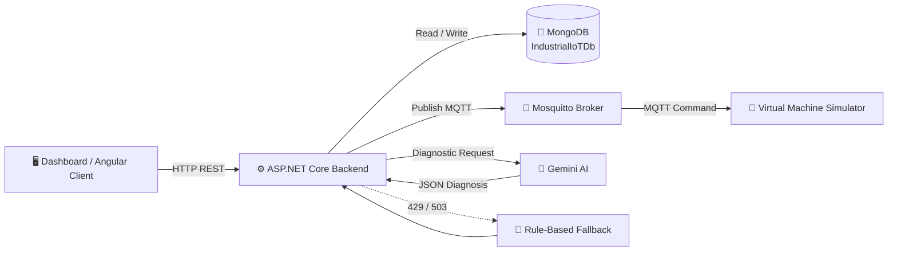

<div align="center">

# 🤖 Industrial IoT Dashboard

### Smart Machine Monitoring • Predictive Maintenance • AI Diagnostics • MQTT Control

<p>
  
  
  
  
  
  
</p>

<p>
  <strong>Industrial machine monitoring and control platform built around ASP.NET Core, MongoDB and MQTT.</strong>
</p>

</div>

---

## 📌 Overview

**Industrial IoT Dashboard** is a backend-oriented Industrial IoT platform for monitoring machine health, storing telemetry, managing maintenance records, sending machine commands through MQTT, and generating AI-assisted diagnostic results.

The project is designed around a simple architecture:

> **Dashboard / Client → ASP.NET Core API → MongoDB + MQTT → Virtual Machine Simulator**

The backend also provides **Stitch AI**, which analyzes machine information and operator commands to return a structured diagnostic response. If the external AI service is unavailable because of high demand or rate limiting, the system can switch to a built-in **rule-based fallback**.

---

## ✨ Key Features

| Feature | Description |
|---|---|
| 🏭 **Machine Management** | Register, list and delete industrial machines |
| 📡 **Telemetry** | Store and retrieve machine health data |
| 📊 **Condition Monitoring** | Track temperature, vibration, current, yield and error codes |
| 🔧 **Maintenance History** | Store maintenance records and retrieve history per machine |
| 📅 **Preventive Maintenance** | Machine model contains last/next maintenance information |
| 📡 **MQTT Communication** | Send commands between the backend and virtual machines |
| 🖥️ **Virtual Machine Simulator** | Simulates MQTT-connected machines and displays incoming commands |
| 🧠 **Stitch AI Diagnostics** | Analyze machine status and operational data |
| 🛟 **AI Fallback System** | Rule-based diagnostics when AI API returns `429` or `503` |
| 📚 **Swagger / OpenAPI** | API documentation during development |
| 🌐 **CORS** | Configured to accept requests from an Angular client on `localhost:4200` |

---

# 🏗️ System Architecture



### 🔄 Main Data Flow

```text
Machine / Simulator
       │
       ▼
   MQTT Broker
       │
       ▼
ASP.NET Core API
   ┌───┼───────────────┐
   ▼   ▼               ▼
MongoDB  MQTT       Stitch AI
   │     │               │
   │     ▼               ▼
   │  Commands      Diagnosis JSON
   │
   └──────────► Dashboard
```

---

# 📁 Project Structure

```text
IOT_Dashboard_Project-main/
│
├── 📂 VirtualMachineSimulator/
│   ├── Program.cs
│   └── VirtualMachineSimulator.csproj
│
├── 📂 iot-dashboard-backend/
│   ├── 📂 Controllers/
│   │   ├── MachineController.cs
│   │   ├── MaintenanceController.cs
│   │   ├── StitchAiController.cs
│   │   └── TelemetryController.cs
│   │
│   ├── 📂 Models/
│   │   ├── Machine.cs
│   │   ├── MaintenanceRecord.cs
│   │   ├── StitchAiModels.cs
│   │   └── Telemetry.cs
│   │
│   ├── 📂 Services/
│   │   └── MqttPublishService.cs
│   │
│   ├── Program.cs
│   ├── appsettings.json
│   └── iot-dashboard-backend.csproj
│
├── 📂 mqtt-broker/
│   ├── 📂 config/
│   │   └── mosquitto.conf
│   └── docker-compose.yml
│
└── .gitignore
```

> ℹ️ **Note:** The supplied ZIP contains the backend, MQTT broker configuration and virtual machine simulator. An Angular frontend folder is referenced by the backend CORS configuration and `.gitignore`, but it is **not included in the supplied project archive**.

---

# 🧩 Technology Stack

### Backend

- **ASP.NET Core 8**
- **C#**
- **MongoDB.Driver 3.11.1**
- **MQTTnet 4.3.3.952**
- **Swashbuckle.AspNetCore 10.2.3**

### IoT / Messaging

- **MQTT**
- **Eclipse Mosquitto**
- **Docker Compose**
- MQTT Port: `1883`
- WebSocket Port: `9001` *(configured for future use)*

### AI

- **Google Gemini API**
- Model configured in `appsettings.json`
- Structured JSON diagnostic response
- Rule-based fallback for `429` / `503`

### Virtual Device

- **.NET 9**
- **MQTTnet**
- Virtual machine command listener

---

# 🗄️ Database Design

The backend uses MongoDB with the database:

```text
IndustrialIoTDb
```

Main collections:

```text
IndustrialIoTDb
├── Machines
├── Telemetries
└── MaintenanceRecords
```

## 🏭 Machines

Stores machine identity, status and lifecycle information.

| Field | Description |
|---|---|
| `machineName` | Machine name |
| `machineType` | Machine type |
| `status` | Current machine state |
| `runTimeHours` | Accumulated operating hours |
| `cycleCount` | Accumulated operating cycles |
| `lastMaintenanceDate` | Previous maintenance date |
| `nextMaintenanceDate` | Planned maintenance date |
| `calibrationDriftOffset` | Calibration deviation |

## 📡 Telemetries

Stores machine condition and production measurements.

| Field | Description |
|---|---|
| `machineId` | Related machine |
| `temperature` | Temperature |
| `vibrationLevel` | Vibration level |
| `currentDraw` | Electrical current |
| `yieldRate` | Production yield |
| `errorCode` | Machine error code |
| `timestamp` | Telemetry timestamp |

## 🔧 MaintenanceRecords

Stores maintenance activity.

| Field | Description |
|---|---|
| `machineId` | Related machine |
| `orderRef` | Maintenance order reference |
| `issueDescription` | Reported issue |
| `resolutionNotes` | Repair / resolution details |
| `technicianName` | Technician / e-signature |
| `completedAt` | Completion timestamp |

---

# 🔌 REST API

Base URL during local development:

```text
http://localhost:5000
```

> The actual port can vary depending on the ASP.NET Core launch configuration/environment.

## 🏭 Machine API

### Get all machines

```http
GET /api/Machine
```

### Create a machine

```http
POST /api/Machine
```

### Delete a machine

```http
DELETE /api/Machine/{id}
```

### Update telemetry

```http
PUT /api/Machine/{id}/telemetry
```

Example:

```json
{
  "status": "Running",
  "runTimeHours": 245,
  "cycleCount": 8750
}
```

### Execute machine command

```http
POST /api/Machine/{id}/command
```

Supported commands:

```text
EMERGENCY_STOP
APPROVE
OVERRIDE
```

---

# 📡 Telemetry API

### Get telemetry for a machine

```http
GET /api/Telemetry/{machineId}
```

The API returns the latest **100 telemetry records**, sorted by timestamp descending.

### Create telemetry

```http
POST /api/Telemetry
```

Example:

```json
{
  "machineId": "YOUR_MACHINE_ID",
  "temperature": 72.5,
  "vibrationLevel": 2.4,
  "currentDraw": 8.7,
  "yieldRate": 98.2,
  "errorCode": null
}
```

---

# 🔧 Maintenance API

### Create maintenance record

```http
POST /api/Maintenance
```

### Get maintenance history for a machine

```http
GET /api/Maintenance/machine/{machineId}
```

### Get all maintenance history

```http
GET /api/Maintenance
```

---

# 🧠 Stitch AI Diagnostics

The endpoint:

```http
POST /api/StitchAi/diagnose
```

accepts:

```json
{
  "machineId": "YOUR_MACHINE_ID",
  "manualCommand": "Analyze current machine condition"
}
```

The intended response format is:

```json
{
  "rootCause": "string",
  "impactPrediction": "string",
  "recommendation": "string",
  "confidenceScore": 0.0
}
```

### AI Diagnostic Flow

```text
Machine ID
    │
    ▼
MongoDB Machine Data
    │
    ├── Status
    ├── Run Hours
    └── Cycle Count
    │
    ▼
Stitch AI / Gemini
    │
    ▼
Root Cause
Impact Prediction
Recommendation
Confidence Score
```

### 🛟 Fallback Mode

If the AI request returns:

```text
429 Too Many Requests
503 Service Unavailable
```

the backend generates a diagnostic response using a built-in rule-based expert system.

The fallback considers:

- Machine status
- Runtime hours
- Cycle count
- Possible operational anomalies

This allows the API to continue returning structured diagnostic information even when the external AI service is temporarily unavailable.

---

# 📡 MQTT Communication

The project uses **Eclipse Mosquitto** as the MQTT broker.

### Broker

```text
Host: localhost
Port: 1883
```

### Command Topic

```text
terahop/machine/{machineId}/command
```

Example:

```text
terahop/machine/MACHINE_01/command
```

Example payload:

```json
{
  "machineId": "MACHINE_01",
  "command": "EMERGENCY_STOP",
  "timestamp": "2026-09-22T05:00:00Z"
}
```

### Supported command behavior

| Command | Simulator Output | Backend Status |
|---|---|---|
| 🛑 `EMERGENCY_STOP` | Emergency stop activated | `Offline` |
| ✅ `APPROVE` | Prescriptive action approved | `Maintenance` |
| ⚠️ `OVERRIDE` | Manual override received | `Warning` |
| ⚡ Other | Custom command | Existing status |

---

# 🐳 Run MQTT Broker

Make sure Docker Desktop is running.

```bash
cd mqtt-broker
docker compose up -d
```

Check the container:

```bash
docker ps
```

Expected container:

```text
mqtt_broker
```

Stop the broker:

```bash
docker compose down
```

---

# ⚙️ Configuration

The backend reads MongoDB and AI configuration from:

```text
iot-dashboard-backend/appsettings.json
```

Current MongoDB configuration:

```json
{
  "MongoDbSettings": {
    "ConnectionString": "mongodb://localhost:27017",
    "DatabaseName": "IndustrialIoTDb"
  }
}
```

AI configuration is also defined there.

> 🔐 **Security:** Do not commit a real Gemini API key to GitHub. Replace `API_KEY_HERE` with a secure environment variable, user secret, or other secret-management mechanism for real deployments.

---

# 🚀 Installation & Setup

## 1️⃣ Requirements

Install:

- [.NET 8 SDK](https://dotnet.microsoft.com/download/dotnet/8.0)
- [.NET 9 SDK](https://dotnet.microsoft.com/download/dotnet/9.0)
- [MongoDB](https://www.mongodb.com/)
- [Docker Desktop](https://www.docker.com/products/docker-desktop/)
- Git

---

## 2️⃣ Start MongoDB

Make sure MongoDB is available at:

```text
mongodb://localhost:27017
```

The application uses:

```text
Database: IndustrialIoTDb
```

The required collections can be created automatically when data is inserted.

---

## 3️⃣ Start Mosquitto

```bash
cd mqtt-broker
docker compose up -d
```

---

## 4️⃣ Run the Backend

Open a terminal:

```bash
cd iot-dashboard-backend
dotnet restore
dotnet run
```

During development, Swagger is enabled by ASP.NET Core.

Open the Swagger UI using the URL shown in the terminal, commonly:

```text
http://localhost:<port>/swagger
```

---

## 5️⃣ Run the Virtual Machine Simulator

Open another terminal:

```bash
cd VirtualMachineSimulator
dotnet restore
dotnet run
```

The simulator connects to:

```text
localhost:1883
```

and subscribes to:

```text
terahop/machine/+/command
```

When the backend sends a command, the simulator displays the command in the console.

---

# 🧪 Example End-to-End Test

### Step 1 — Start MongoDB

```text
MongoDB
   │
   ▼
localhost:27017
```

### Step 2 — Start MQTT

```bash
docker compose up -d
```

### Step 3 — Start Backend

```bash
dotnet run
```

### Step 4 — Start Virtual Machine Simulator

```bash
dotnet run
```

### Step 5 — Create a machine

```http
POST /api/Machine
```

Example:

```json
{
  "machineName": "Machine-01",
  "machineType": "Wire Bonder",
  "status": "Running",
  "runTimeHours": 120,
  "cycleCount": 4500
}
```

### Step 6 — Send a command

```http
POST /api/Machine/{id}/command
```

```json
{
  "action": "EMERGENCY_STOP"
}
```

### Step 7 — Observe MQTT

The simulator should receive:

```text
terahop/machine/{machineId}/command
```

and display an emergency-stop message.

---

# 🧠 Example Diagnostic Scenario

A machine has:

```text
Status       = Warning
Run Hours    = 520
Cycle Count  = 12,500
```

A diagnostic request can be sent to:

```http
POST /api/StitchAi/diagnose
```

The AI / fallback system can use these machine conditions to produce:

```json
{
  "rootCause": "...",
  "impactPrediction": "...",
  "recommendation": "...",
  "confidenceScore": 82.5
}
```

The exact result depends on the machine data and the configured AI service.

---

# 🌐 CORS Configuration

The backend currently allows requests from:

```text
http://localhost:4200
```

This is intended for an Angular frontend.

The relevant CORS policy is:

```csharp
policy.WithOrigins("http://localhost:4200")
      .AllowAnyHeader()
      .AllowAnyMethod();
```

If the frontend uses another host or port, update the backend CORS configuration accordingly.

---

# 📚 API Summary

| Controller | Endpoint | Method | Purpose |
|---|---|---:|---|
| Machine | `/api/Machine` | `GET` | Get all machines |
| Machine | `/api/Machine` | `POST` | Create machine |
| Machine | `/api/Machine/{id}` | `DELETE` | Delete machine |
| Machine | `/api/Machine/{id}/telemetry` | `PUT` | Update machine telemetry |
| Machine | `/api/Machine/{id}/command` | `POST` | Send machine command |
| Telemetry | `/api/Telemetry/{machineId}` | `GET` | Get latest telemetry |
| Telemetry | `/api/Telemetry` | `POST` | Create telemetry |
| Maintenance | `/api/Maintenance` | `GET` | Get all maintenance records |
| Maintenance | `/api/Maintenance` | `POST` | Create maintenance record |
| Maintenance | `/api/Maintenance/machine/{machineId}` | `GET` | Get machine maintenance history |
| Stitch AI | `/api/StitchAi/diagnose` | `POST` | Run AI diagnostics |

---

# 🔒 Security Notes

Before deploying this project outside a local development environment:

- 🔐 Never commit real API keys.
- 🔐 Disable anonymous MQTT access.
- 🔐 Configure MQTT authentication and authorization.
- 🔐 Use HTTPS for the REST API.
- 🔐 Restrict CORS to trusted frontend origins.
- 🔐 Store secrets using environment variables or a secret manager.
- 🔐 Add authentication / authorization to machine-control endpoints.
- 🔐 Validate and sanitize incoming telemetry and commands.
- 🔐 Consider TLS for MQTT communication.

The current Mosquitto configuration contains:

```text
allow_anonymous true
```

This is convenient for local testing but should **not** be treated as a production security configuration.

---

# 🛠️ Development Notes

### Backend Target Framework

```text
.NET 8
```

### Virtual Machine Simulator Target Framework

```text
.NET 9
```

Because the two projects target different .NET versions, make sure the corresponding SDKs are installed when running both projects.

---

# 🗺️ Future Improvements

Potential next steps for the platform include:

- [ ] Complete / integrate the Angular dashboard
- [ ] Real-time telemetry streaming
- [ ] MQTT authentication and TLS
- [ ] User authentication and role-based access
- [ ] Predictive maintenance models
- [ ] Historical telemetry charts
- [ ] Machine health score
- [ ] Alarm and notification system
- [ ] Automated preventive-maintenance alerts
- [ ] Dockerize the complete application stack
- [ ] Production-ready secret management
- [ ] Automated tests and CI/CD
- [ ] MQTT retained messages / Last Will and Testament
- [ ] Centralized application logging

---

# 📄 License

No explicit license file was included in the supplied project archive.

If this repository will be published publicly, add a `LICENSE` file specifying the terms under which the project may be used.

---

<div align="center">

### 🚀 Industrial IoT • Connected Machines • Intelligent Maintenance

**Built with ASP.NET Core · MongoDB · MQTT · Mosquitto · Gemini AI**

</div>
